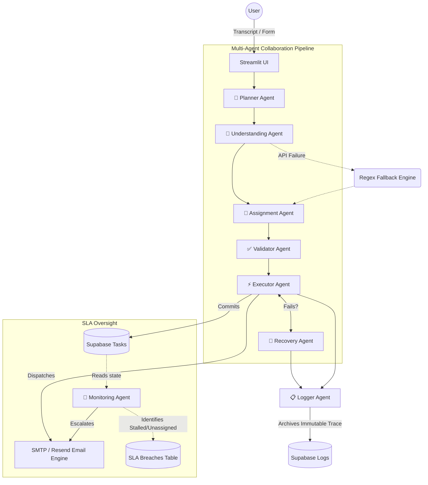

# 🏗️ Architecture Document: Agentic AI for Autonomous Enterprise Workflows

## 1. System Overview

**Agentic AI for Autonomous Enterprise Workflows** is a robust, multi-agent AI system engineered to completely automate critical, high-friction enterprise operations. By heavily leveraging a collaborative network of specialized autonomous AI agents, the system bridges the gap between unstructured human inputs (such as meeting transcripts or HR requests) and structured system operations, drastically reducing manual overhead.

The platform natively supports three core pillars:
1. **Meeting → Action Workflow**: Extracts unstructured meeting transcripts into assigned, executed, and tracked system tasks.
2. **Employee Onboarding Workflow**: Dynamically assigns roles, provisions software/hardware, and identifies SLA-friendly onboarding buddies.
3. **SLA Monitoring & Escalation Dashboard**: An autonomous oversight module that monitors breached tasks and triggers IT command-chain escalations.

### Technology Stack
- **Backend Orchestration**: Python (Object-Oriented Agent Classes)
- **Frontend Dashboard**: Streamlit (Responsive, State-Driven UI)
- **Database & Auth**: Supabase PostgreSQL (Persistent state, Audit trails, and Secure Login)
- **Communication Layer**: SMTP / Resend API
- **AI / LLM Engine**: Hybrid capability supporting Groq (Cloud), Google Gemini (Cloud), Ollama (Local/Air-gapped), and a 100% Native Regex Rule-Based Fallback.

---

## 2. Agent Architecture

The system's intelligence is distributed across a highly modular array of specialized Python agents. This ensures strict separation of concerns, massive fault-tolerance, and transparent reasoning. 

- **🧠 Planner Agent** 
  *Responsibility:* Analyzes the incoming request and formally defines the stepwise execution plan for the downstream agents.
- **📄 Understanding Agent**
  *Responsibility:* Scans the unstructured text (e.g., meeting transcripts) using external LLMs or internal regex rules to extract actionable items.
- **👤 Assignment Agent** 
  *Responsibility:* Maps extracted tasks to enterprise personnel intelligently, assigning a confidence score to each delegation.
- **✅ Validator Agent** 
  *Responsibility:* Acts as a sanity check. If a task owner is ambiguous or confidence is low, it halts execution and safely triggers human-in-the-loop clarification.
- **⚡ Executor Agent**
  *Responsibility:* The "hands" of the system. Pushes tasks to the Supabase database and triggers targeted email notifications to the assigned personnel.
- **🔄 Recovery Agent** 
  *Responsibility:* Monitors the Executor's operations. If a database timeout or email bounce occurs, it natively orchestrates retries and executes fallback safety logic.
- **📋 Logger Agent**
  *Responsibility:* Compiles the reasoning, timestamps, and outcomes from all preceding agents into a rich JSON structure and pushes the immutable audit trail to Supabase.
- **🚨 Monitoring Agent** (Asynchronous)
  *Responsibility:* Operates completely independently to sweep the `tasks` table. It identifies SLA breaches, forces urgent reassignments, and fires escalation alerts to IT Command.

---

## 3. Communication Flow & Pipeline

The multi-agent collaboration operates as a strict, sequential pipeline augmented with closed-loop feedback mechanisms for extreme reliability:

1. **Ingestion**: The user submits unstructured data via the Streamlit frontend.
2. **Decomposition**: `Planner Agent` breaks the data down into a stateful `WorkflowContext`.
3. **Extraction & Delegation**: `Understanding Agent` and `Assignment Agent` populate the context payload with tasks and owners.
4. **Safety Gate**: `Validator Agent` ensures zero tasks bypass the pipeline without a valid employee mapping.
5. **Execution**: The `Executor Agent` attempts to enact changes (Supabase commits, Email Dispatch).
6. **Self-Healing**: If an execution tool throws an anomaly, the `Recovery Agent` catches the exception. It uses an exponential backoff retry mechanism (max 2–3 attempts).
7. **Audit**: The `Logger Agent` sweeps the final memory context and archives it.
8. **Asynchronous Oversight**: Minutes/Hours later, the `Monitoring Agent` scans the persistent task logs to ensure the generated tasks were actually completed by humans. Unassigned or stalled tasks trigger the escalation mechanism.

---

## 4. Tool Integrations & Datastores

The agents securely interact with external systems using a strictly typed, mockable `tools.py` paradigm.

**Database Layer (Supabase PostgreSQL):**
- `existing_employees` / `new_employees`: Acts as the source-of-truth for HR mapping, Buddy assignment, and role configuration.
- `tasks`: The primary staging ground for the Meeting-to-Action pipeline. 
- `sla_breaches`: Archives timestamps and contexts of tasks that violated their service level agreements.
- `logs`: Serves as the ultimate, immutable audit trail repository for compliance metrics.

**Communication Layer:**
- Natively integrated with **Gmail SMTP** and **Resend API**. The API keys are dynamically loaded from `.env` and injected into the pipeline securely to trigger routing.

---

## 5. Error Handling & Enterprise SLA Logic

The defining feature of this system is its enterprise readiness, designed under the assumption that APIs fail and emails bounce.

- **Hybrid Intelligence Fallback**: If the external API (Gemini/Groq/Ollama) crashes, rate-limits, or runs out of RAM, the system aggressively catches the exception, logs it, and natively falls back to a handcrafted **Regex Rule-Based Engine**. Unstructured parsing continues without interruption.
- **Retry Mechanism**: The `Recovery Agent` wraps volatile calls (like SMTP dispatch) in a 3-strike retry loop.
- **SLA Breach Detection System**: 
  - *Time-based Triggers:* Tasks stagnant in the `tasks` table past their deadline.
  - *Status-based Triggers:* Tasks forcefully created as "Unassigned" because of missing personnel.
- **Escalation Path**: When a breach is detected, the `Monitoring Agent` bypasses standard routing, packages the original inputs and agent-reasoning chunks, and force-routes a high-priority `"🚨 SLA BREACH"` email to the internal IT Response Team.

---

## 6. Architecture Diagram

---

## 7. Deployment Architecture

The system is designed for stateless deployment, utilizing managed services for state persistence:
- **Repository Management**: Standardized CI bounds managed through GitHub via `.gitignore` and `requirements.txt`.
- **Compute Layer (Render / Railway)**: The backend agents and Streamlit application are deployed as a persistent Linux web service utilizing a `bash start.sh` boot sequence script to streamline dependencies.
- **Data Layer (Supabase)**: Secure integration via `db.py` handles connection pooling and timeouts (with fallback protocols gracefully handled in offline scenarios).
- **Scalability**: Because the Python `agents.py` execution is stateless relative to the compute memory, horizontal scaling across container nodes is easily achievable.

### Key Design Principles Highlighted
1. **Modularity**: Agents and Workflow logic are completely decoupled.
2. **Fault Tolerance**: Hardened multi-layer fallbacks protect against external API failures.
3. **Auditability**: Complete step-by-step reasoning logs ensure highly transparent actions.
4. **Hybrid AI**: Merges advanced LLM capability with predictable, deterministic rule engines.
